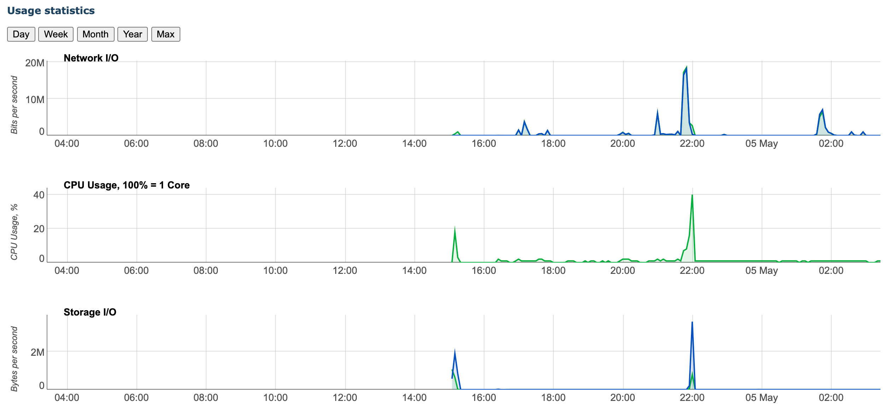

# A Simple Manual for SometimesNaive

## Backgrounds

+ 内核：[Xray-core](https://github.com/XTLS/Xray-core)
+ 协议：VLESS + TCP + XTLS（仅有 Xray 内核支持）
+ VPS 物理地址：JP - Equinix Osaka SoftBank
+ VPS 规格：
  + CPU: 1x Intel Xeon
  + RAM: 1 GB
  + SSD: 20 GB RAID-10
  + Transfer: 500 GB/mo
  + Link speed: 1 Gigabit
  + OS: Debian Buster
  + Support China Telecom CN2 GIA
  + Enterprise level transport for China Unicom provided by China Telecom

## QR Code (Important)

![img](data:image/png;base64,iVBORw0KGgoAAAANSUhEUgAAAQQAAAEECAYAAADOCEoKAAAaGElEQVR4Xu2d4XajSgyD2/d/6N7Tns0uuSX4wxKGUu1fPGNbljUekmbfPz4+Pt7yLwgEgSDw9vb2HkEID4JAEHggEEEIF4JAEPiLQAQhZAgCQSCCEA4EgSDwHYFMCGFFEAgCmRDCgSAQBDIhhANBIAhsIJArQ+gRBIJArgzhQBAIArkyhANBIAjkyhAOBIEgQBDIOwSCUmyCwC9BIILwSwqdNIMAQSCCQFCKTRD4JQhEEH5JoZNmECAIRBAISrEJAr8EAYsgvL+/XwYu+nsvazGvraV2FICr70fzoHZKvspaGt+aHfX7E3lf4RJBWCAUQajosv85bS6lMfdHtb2CxhxBeIHjTwRGKTqdQiZITvNwNw3dT4lPWUvjU2r0E3lf4ZIJIRNCxRHpudLUylolaOo3gpAJ4QuBTAi83WhzKSc1j4ZZ0pgjCDsEQWkaVra3t4nC0TxoLBO5Ke9CJkjujm9iv58oWJRrS7vDrgy0kTpBP9bQJlRITvOgsdB86X4TdjRmajfRwG5cIgi0up+/5b7ysSNtpB1uvplSvxEEXiMFK1rLCAJFat2O8r7jJRNCgRoVNneR6H4Tdh1iba2JIGiI0pp3vEQQIghPCGRC4C+Nj2zMLVoe6XdUEBSyKacKvf9RRaVTg+KX+qCYKvu517oJrWCgxELX0vjW+OLmfcXxCEKF0Mpz2iARhPXTljYSLQ1tOHdz0TxofBEEWvEXn/3TgiiNSYtEU6HkoKIzsZ8Si7sJlVq6Y6H8ozWiXKN+KSeXdpkQGqjRBnGT96z9aL6UqNSOloY2XAShRjSCUGP0zYI2yFkNTE8aGh/NlzY6taOliSDwF6EVpr9CEChhKrAez2mD0P2U+OipR2NR9lNwcWNA86V+KS7UjsZH91Ow/3VXBlp0pUh0LT2V6X6UMBP7KaRUajThl+JM7dz1UDCIINBqvLBzgf/Y3t0MZ+2n4OKOmZaY+qWNTu1ofHQ/BfsIAq1GBOELAaVpKNTUh/J+RJnOlMZ05+Z+BxNBoCyNIEQQ/nAggrCjaahi/SSl3BrnKTkohMq4p2BK46N2FBdqd9Y0QP3ekfe/4lMGSmg6UiqEpmSjMUcQKFL86kNrFEF4gf0dgcmEwBvtYUmFktrRxqSRKuJJY6Z2NGa6nzJl/rp3CBT8TAgKUtrfLdBmVYhPfVAhuuNBmCtD0QNnFZ22pkJy6oPaKacZzSOCwH/shtbttAmhE+DWGnezThBaOX2UtWc1Eq05jU+pOfVBY6ax0P2o3ZF+RycEmjC1o8Aop4/bh9LUylqlGSh+tG40D/cVTsFAiUXBZdpvBGGBeCaEdepGEDgubtGJIOyQU/fpHUHgxN9RJmRKG0mpOfWBAv4BPy5M88g7hBdIRRAiCHuaiIrTnj2J7ZF+D7sykMSOsHE3dfbjb7UpUe9sdwSnyZ6u6SeCsED7zkSNsM0IG2neI2wiCENjfxppppHugvMRzU72jCBEEL4QuEsj3SUP0rxH2EQQIggRhD8cuNJV74hmJ3teShBIwFezoZ+tT5xcFBsa89p+CmGoX+qD7kdxUfKlYqLE8pPWWl4q/qSEH7FSUkYQ+J8NRxB+Yic8xxxBKGoYQYgg/Pw25xlEECIIJVuUaWptc7pfGdiGgTKt0LVKfFddG0GIIJTcpA1MG4nuVwYWQVAgWl1rEYSzCqz4peR1n3D0CmKvtHlDih99aUdrqfidePmo5Eu5QTHolDyC0ECNkpcSUNmvEb5lCSWl0iAUP0W0J/JQGp3iZynq5x9sfVBENjxOEJqCSoFR0lbydedB83XbUfwooSmmil+3wNBaTti56htBaCBJyUsJqOzXCN+yRGlM2iAUv0wIlpJ+bRJBaGCpNLDSDI1QD1sSQbjW18ZdhR4VBKUZKAHdpwVtfiU+VzH37nNWbso1guKs+HBPJkrMtKbUR7VfBGGB0FmCVRXpqOcRhJkvXdFmpfVQBKviUgQhglBxZPUvKstFGwbK6a0014Tg09yUSTaC8OLPfCkpqfJOEIbGPGGn4KLER5uG2tHmmqivO2aKMxXKar9MCJkQKo5kQthxIEUQXtBJAYYqPh2dJmJxKfRWd9I8FLtSHXYaUFxozJQbyjSwM8Unc3e+Ci6dPCwTglIkGrQy3rpBde+nYECJT+1oLNTO3SAK1yiHaG70QHLHTDHt5BFBaKAWQeCgUfIqmNK1EYS6bhGEGqNvFpSAja03l1C/ip075gjCOqJKjSimnVpGEBqo0WI2to4gLBCgxKf1yIRQM9IiCBRoWmD3nauG4VwL5X6vYEqzVhrOnRvlGs2N4kf9Kvm6Y6b7Le0iCB3UzGsUElFCKyFHELRvNFIxoTU6suYRBFqFA+0iCOvgKrjQctHmok19pZgpBpkQOkgduEYhESW0En4mhEwIu/ijqCd1pJCS+jjLLoKQCWEP9448BE6/MpzV6BTUs8SOEuTqebjjW8OF+qCYul9qK/HR/lByu9SVgSZMG5MCQ4tE/dL9KNnukgfFheIcQVj/YRbKl8ouE0KBECUqJX4EYR1winMEIYLwxQGFMAqJqN8IAv9v488Sxep03HquTLJubij7VRhkQsiE8ISAQjbaNBGEqi3/PVcw5V4W/o76GXZKrImE6SlPAVQ+FVCmFRofxZTiQmvpbnSaL60HtVP80rVurJQaLWM5bEKgAVLyngU0bWDaXHQ/d75KM9BauklOMaC5UTvFL13rxkqpUQRBqdqLX8+JIKyDquBCy0QbndopfunaCMILpDIh+N8aU0xpsyqnD/WhNBJtdGpHY1FwiSBEEF7ybIJYSjMo8UUQqLxon6QpNbJfGajaUVJSO+U+TolKY6EFUfxSnCkFaW4UZ2UyUfBT1iq5UZypHa0HzZf6jSDs+F6Du0gRBP/3FWiDKNjTtZ0mfKxxc60Ti+VTBnpyKQnTgpxFjgm/FGdKBFoP5RSlPhT8lLVKbhRnaufGivrNhJAJ4YsDlIBK01AfSlMra5XcOg23tcaNVSe+TAgFau4inTXpuImv4ELfNdCJKILQaf31NRZBcBeYkpfCQJtQ8UsxUGKh+dIGofu57ShWVBBofBQXJb6JmN3x2a8MSoC0QWgxJwpCfdBTlBKa2ilYUR+K3QRfJsSdYkA5TmNW8KtizoTQuDJEECpabT9XCO1uLqWWFAV3zAp+VcwRhAhCxRH7c4XQ7uaKIDwjEEGIINgbvtowglAh9O85vXa6rokWQVBU1k0OBRh6+kz44JT5bknjU/KldVPs6J36SvyjMSu40Pp2OBRBWKCmNAgFn/qg+1EC0qah+7kJTXGhzeCO7+r4KXxZro0gRBBKLiljq9KYVJxosyp5UB80ZgUXKoplYVcMIggRhJI3SiMpxKfNRZtVyYP6oDEruEQQXlCWgloy/o+Be2xVSERjpgRUYlEaidbIjb3ilzacEvNEfB0OWSYEBZhO0FtrzoqFFpjmS/ejdm5BoHlQv1R0qAC6caEiQfOl+FFclPjs7xDOakIFfBeAjxgUAtI83OQ4q24UKyU+6kPBnjY1zWNC7KqYMyFUCMHnCgEVUip+KVHPEk8lPjcuCgY0jwgCbLY9ZhR8pcBKA9NcKKGpHY2ZkpLmQf3S6YfG58ZF4Qvl5ERuVd0yIVQIwecKAd1NQ8lLiUr3g1Ct/i9cEYR19CgurhpZBIESmhJGsXMDSJtGiZmeDArOlDAT+dJY3PleKTclFgW/iqcRhAIhpXAV+FvPadFpfO79JnKLIPCpQanHcm0EIYLwhAAVGIWAVJwiCBEEhWdfa3Nl0EgUQdAoSMVOwZn66GSSCSETQiaETue8WEOb9dcJAsWYvp2ndsqYSWN229GphvqlpHRj5c5jLT7qg9pRHxQrxa8SC+VGZXfYhFA5fjynjU7taOFofBN2VyKR++RS9qMNQrlBY6GC6vZL8z2SkxGEI9GFe0cQIFDiO6IIQo1zBKHG6HCLCAKHmGJF7ZRTORMCrxu2VEBVRjsc4IChQl6F0O7rlTsPmpvCIeqDYuXGgHLcRdPDJgRlPKNrXSBs7UMLQklJiUVzcxNwwq87ZlojN/YUK7foKPtVMUcQCoQo2SII6/+rMyWvcgjQGkUQKjl4e4sgRBBqlqxYKKe8spYKDE1KESLqQ4mZxqeI4jK+CEIEocVrpamVtUpzZUKoSx1BiCDULMmE0MLoqHdTblG0Twj0/uy2o1Wiful+7pOGnpjUzk2YibGV+rhLbrSWil2Hz5YJgTac244mTP3S/SII60gp99gIwvpL2QjCGweGNnAEYf2vQBX8zjqpz/LrFjul0Y/kcyYE2hWFnfuEo0Wnft2EPqsxz/Lrxi+CsOPkp81Ae9m9X64MuTJQ7n3aUf657fbE+LC1TAhKg0woJQVayaMD/t630DSPq9tRnCk36NRApyllP3fMbl5V+0UQDrwKVOBHEP4hoIiY0sC0RrTRqR2NmcbnsosgRBCeEKCEVuwyIfivXBGEA+5mlKgu8DMhZEJYckB5ceniZCaETAiZEEA3KRMRfXdxa0Fwn7YKWPR+Cnixy4QSwX2fdOer7DeBgRIf5ekE/9x57CLrH+PDJgQKNA16oiA0Fmo30QwU57Pwm8DA3Uhn7ef2S3m6tIsgdFCDayaaIYLAP+eHZcPfG3DvF0GgiL74cU26/CygIwj8R1OUa5O7vmft5/ZL+yMTgigwFOgIQgThkyu00akd5V/HbvTKQANUGon6oG+N6X7Uzu3XvZ87D/rugtac7kfzoFcuZT+6diK3KpYIwgIhSsoK1K3n7gZ270dzo34pySn2dD+aRwThGYEIQgSh1TsRhBZsm4smxK6KOoIQQag4svo8gtCCLYLQgY2Oj529H2sooRUfa2vdft370XypX3rq0ZrT/WgeuTKceGWgRaeNRItJSUTf8lI7hZR0rYIp9UHxo/tRO4ozxcAtYjQPaqfk66rR6JWBFi6CQCmkfaxHvbjIRv097JQGoRyiPvbG3rGnsVC7Vgwfg9WOIHRKtL1GwZRGM0iRp5Ao8SkGmRDqimdCWGCkEPBKTVOXfZ/FlXKjTZ0JYV+N/05lmRD+ARdBWCdRBKHXXHtXXYF/lgmBJqK8BKRjIS0CJbnil55m1E459ehait+VcLkSfrQX3Ha0bpVdBKFA6ErEp01NY6aiSIW8ItvjOW1gt90Efu5Gp/tR7Cu7CEIEoeLI6nMqOkoTRhD4H0a1iriyKIIQQWhxKYKw/r9h0RPdbdcqYgThHwJ0XL4S8ZXTlq6lxLoSLnSSoBjQ3KjfCTtat8rusAmhcrx1n6R3VjfQCmHcAkP3+4lYuXGmpy3FinKX5qH4VTjeySOCUKDmLohy+tAC0wZR7GgzKPkq8VFBpfFR7N1+3fyr8oggRBCeEKAEjCCsEyeC8OInoiolypVhGyFKLDqO0kandhGECMJLBitjFyW+e3ykMdMGUfKgzUVF9upY0XzdeVDxpDjTPBS/bv5VuVmuDJWTvc9ps9J9abPSwrmL5M5XwYXGMoGB4kPJg+JH7ZRYqCjSWCq7CEKBEC0ItaOiUxXO8Zw2HD0J3RjQ+KgdzcOB7XKPCIKIKAWQusmEwO+7FHvahBR7KiaKXQSh7phMCJkQnhCIINRNs9fiLEz3xvlpH0GIIEQQOp2zY00EYcf/VkPv1HT03FGnb6a0cIoPdx7umOlVgI7f7vgmsHfHrNScxqL4eHrfcdQPpNC7XgRBobj/NxUjCDOY0qpHEMTpggJNhUjZj56iig9KGOojghBB+KBk2WOXCYG/2d+D6/9tIwgcPTpWT2BKo6ax0Nwqv4e9VIwgRBC+3lq/v1ccHHtOm8YdM/WrTK2Kj9u8Q6CFo2DR/a50FaC50a67upDTGilXH6W+Cn5UENw1jyC86A5KNoUwSmOe5ZcS0N0MtEEoLhP1dWPg3q/i34++MtACK4SuAHw8pz7ofu7cFL80twnyKrjQtVRgqGBR/Cb2q3gQQVggNEGYqiCP5zQWhWxuAkYQ/D+KOoFprgy5MrzUJYWAytoJoaQimwmBVmOokRRiuddSclC/CilpLGI5vy2nudGJwx0fxcWNvZLHWS89q5gtVwYFaAoMHY0nyKvErGBFiV8Vfe/zCUz3xlTZ0xpV+xz13B0f7Y8qnwhC4x0CLSa1q4q09dxFhC0fEQSlQutr3dxw8SCCEEEo2R5BKCHabRBBeAEZBYYq4AR5lZhzZdjdO60FtEatzQ2L3PHR/qhCt0wIlZO9z2lT0+ZygfXIg8ZH86Z5TLxDoLlRO4rBmt2EDxqfEouylsbnsosgNJB0FziCsF4EN86NUv9dosSirFVi7qyNIDRQcxc4ghBBaNDwkCURhAasEQT/N/JyZWgQ8YAlEYQGqBGECMInbei7KTdfGpTFSy4pCMppQcdvdzHPKrqSL11L2TSBKY2FvoClGNDcaHzUL93PFV8EoUCcNjq1owWmdpRY7o+5aMNNiDvFSsHA1XCPWGndlNzo2qVdBCGC0OHN6hraNFQ8J5qG+qC5UTCpX7qfK74IQgSBcq60o6SMIPh/Wo5iXxUxghBBqDiCn1NSRhAiCJhUn4YKYSgpdwXUNFbyoC7pvZjaKe8G3O8L3LWk9VDyoHVTrgxuXC7/DoEWjtrRIrntaHxucrj9KgRUYlH8upua5kE55K459VvZXfLKQMGndhUIRz2n8bnJ4farNKYSi+I3gtBjdQShhxtapTQDcvDiyzFuv0pjKrEofiMIlEHPdhGEHm5oldIMyEEEgcL0ZUfr4RYTuh9Nxi2UI+8QlDFYebHl9ktjoWRT7GgslFjUTsF04mUmjc8dC/VLcab1pRzq+D1sQnCDRVXR7dddJFpMmgfFpUOOxxoai4IVXaucthGEmgURhBqjbxaUWG47pWkaaf5dEkFY/0MmBRdaD4VD1EeuDB2kFmuUImVC4F/KodMPbUxaNyq81K9CNxozxaqKJRNChdDKc6VIEYQIwh7KKVzb4+fv9fDDIC2U5BP3PwVAqviKD4oB9dEpumONgTatMBSuUYeUB3Q/ancWpvYrg1IkCj5tELedMj7SAlP8KFaUgIodzU3xoYin4vcsnM/CNIKw4/P7CMJ6a51FXiqeEYQeApZ3CEqRqBq7T366XwQhgtBrrf2rzhLZTAiZEPaz9X8rziKvcvjQpOkhRfejdmdhahcEmvBZdkqBlUmCThcKLjQ3hWxX8qFgRTFwi44bP3d8EYQdrIog+D8mpC8Ld5QJmUYQapgs7xBqN+daUIWmJ7p7PwUdGgttBqVZJ3woWNH43Cewu0bu+DIh7GBVJoRMCJ90oWIyIagRhB0NrBQkE8I60O4Tzl0jSg/a1O6Gc+Pnjs8+IdCEaeEUO/eJrsRC1ypEVXxQYil2Snx07YTAUF5RO+XwoXzp4Gd5hxBB6ED/bw0tsIIzJarbjiJDMaD7KVi5m5XGomBPcansIggVQgPPaTNQYk0QmpKXwkcxoPspWE3g5/ZBcansIggVQgPPaTMoJKcN7Laj8FEM6H4KVu5mpbEo2FNcKrsIQoXQwHPaDJRYE4Sm5KXwUQzofgpWE/i5fVBcKrvDBMFd4LVE6MsuurYCa+u5u0EUwtC1NF8FZzf2FGfKPyocdD+arzsPWsvKLoJQIQSf0wLD7VbNFB8ThKa50SakwqYIFo1lAj8lD4p9ZRdBqBCCz5VmhS5WvxxzJULTPGjMEQTtC1G0Hku7CEIHtZU1EQQOZASB/2irMpnwivyzjCB0UIsgjHyVNxPCzSeEs04G6nfilDfpz99tzoqZnlzKvdhdNyXmibopLyRd8Y1OCLTA7pOB+j2ruZRinhWz0lzKWjc3aBMqNaIx01gofp2YIwgL1M5qrk7hHmvOipmSMhPCenUn8OvwKoIQQejwBr9DiCBEEL4QcJ9cdD9qR8c4et1odZVhkZKv4n7ihKPYUwyUmBWsKNdyZdiBslJ0ekq57ZQC01gUHzvg/2aqxEf9Uh9nCceV8qCxVHa/9sowITBKs9JmUHxU5Nh6rsRH/VIfEQSKaG0XQVhgpBBQGUcVcYogaD/xRmtet9JrC+pDETYlvuXaCEIEocUlSvLW5n8WUR9KI1EfV89DiS+CsOOl51mnt0JUZS0l1pV8RBBo1Wq7Xzsh1NDss7jSlYFGThuJ7kft3CJL/brzvVIelH8VVhGECiH4nBaEnqzUDoa3auZuEBrLlRqJxrxmd6U8KP+qfCMIFULwOS0IbXRqB8OLILzxl48U0wjCC6QoeZUTSQFf8auQY22tghUVHRrzBC5XP1kpVlfPw8WNTAgKIxZraUEiCPxbrBRTWkK3ACqHFI1ZOVQ6PkYFoRPg1hqluWgsZxWdxucmzASmymlLcVHqRjGgsShC5BbFKuYIQoGQQqwK/KOeK4SmaxWSRxB45SMIHKu3CfJGEPiIv6N030wpztQH3U+xo7Eo4hlBoCi/eGtMC0zd0P2mC+e4SinXDYXkmRAo+27+E2ocBmaZCWEdJ4pLBIFPP4rgK+Kp+GVd9Gx12DuETjCONcqJPtFItAkVLNwYuGNxY0DzpXko+9G1tNEVTtJ8l3YRhAUaCvjutZ1iPtYopFROM3oViCDwq4DCqw6HIggRhCfeRBD4NYIKoNLUytoIwg/4K0b36egmZQQhgvDRUZKne8f7u7qFbb17XJ646000IT1pJmJxiyKtOSWZsh9dO8Ermq/9HULHcdYEgSBwPQQs7xCul1YiCgJBoINABKGDWtYEgZsiEEG4aWGTVhDoIBBB6KCWNUHgpghEEG5a2KQVBDoIRBA6qGVNELgpAhGEmxY2aQWBDgIRhA5qWRMEbopABOGmhU1aQaCDQAShg1rWBIGbIhBBuGlhk1YQ6CAQQeigljVB4KYIRBBuWtikFQQ6CEQQOqhlTRC4KQIRhJsWNmkFgQ4CEYQOalkTBG6KQAThpoVNWkGgg8B/z62W5AGpXaQAAAAASUVORK5CYII=)

## Getting Started

### Windows

#### 客户端：v2rayN

**4.14 版本**下载：[v2rayN-4.14.zip](https://github.com/2dust/v2rayN/releases/download/4.14/v2rayN-Core.zip)

官方 release 仓库：https://github.com/2dust/v2rayN/releases

#### 使用方式

1. 解压压缩包，打开 **`v2rayN.exe`** ，点击桌面右下角的图标打开

2. "设置" -> "参数设置" -> "v2rayN 设置" -> "Core类型改为Xray_Core" -> "确认"
3. "服务器" -> “扫描屏幕上的二维码”
4. (可选) 右键点击「服务器列表」中新添加的条目 -> "测试服务器延迟Ping"，查看是否可以 Ping 通
5. 右键点击「服务器列表」中的条目 -> "设为活动服务器"
6. "设置" -> "路由设置" -> "基础功能" -> "一键导入基础规则" -> "确认"
7. 右键点击桌面右下角的图标 -> "系统代理" -> "自动配置系统代理"，开始使用

#### 

### Android

#### 客户端：v2rayNG

**1.5.16版本**下载：[v2rayNG_1.5.16_arm64-v8a.apk](https://github.com/2dust/v2rayNG/releases/download/1.5.16/v2rayNG_1.5.16_arm64-v8a.apk) 或者 Google Play 中搜索 **v2rayNG**

官方 release 仓库：https://github.com/2dust/v2rayNG/releases

#### 使用方式

1. 打开 `v2rayNG` 程序
2. 点击右上角的 "+" 号 -> "扫描二维码"
3. 点击右下角的 "V" 键，开始使用

### IOS

#### 客户端：ShadowRocket

需要**美区 App Store 账号**，注意 ShadowRokcet 的版本需要 >= 2.1.68 (1162)，之前安装的版本不一定支持

*TODO：提供长久可靠的美服共享账号*

#### 使用方式

*TODO：待完成，应该也可以扫描二维码*

### macOS

*TODO：Qv2ray 或者 v2rayN*

### 软路由

*TODO：OpenWrt + HelloWorld 插件*

## BenchMark

+ VPS 双向流量上限为 500GB/月，带宽上限为 1Gbps，和市面主流梯子对比，大致可以满足 5 人的中度使用或 10 人的轻度使用需求，且不限制设备数量
+ 简单的测试：
  + 节假日（5月4日）晚高峰时间，可以轻松跑满上海电信 200Mbps 带宽，CPU 使用率为 40%，受限于物理带宽，暂时无法测试更高的带宽并发量
  + 节假日（5月4日）晚高峰时间，观看 [youtube 4K 60FPS 视频](https://www.youtube.com/watch?v=zCLOJ9j1k2Y&t=74s)，缓冲速度峰值达到 210Mbps，基本可以稳定在 150Mbps，播放流畅；8K 60FPS 视频受限于客户端 CPU 性能（视频解码 + 流量加解密），可能会造成电脑卡死，最好使用专门的软路由
  + 节假日（5月4日）晚高峰时间，在上海电信网络 ping 主机域名，平均延迟在 40ms 左右，未出现丢包现象，连接稳定
+ 未来可能存在的瓶颈：服务端 CPU 性能较弱，考虑升级到双核

